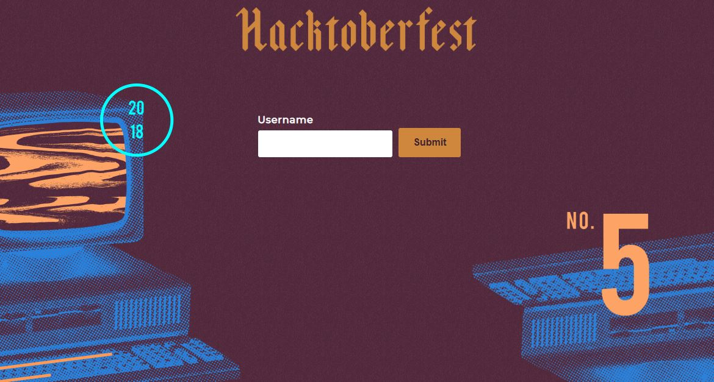

# hacktoberfest-2018-checker

This checks your progress through Hacktoberfest 2018!

The project is very simple and great for beginners. Experienced people are also welcome, of course; afterall, there's always room for improvement.

It uses NodeJS and AWS Lambda. In order to mock AWS Lambda's behaviour, this project uses the https://serverless.com/ framework.

Feel free to create a pull request to help improve this project.

## How to run

1. Run **npm run bootstrap** - this commands installs node_modules in the root, client and the server directory.
2. Run **npm run dev** - this commands ups the serverless setup in server directory and concurrently, ups the webpack-express-server in the client directory.
3. Open [http://localhost:8080](http://localhost:8080) in a web browser to start using the app.

## Other features

- If you use Visual Studio Code, just open the directory and hit F5. VSC will start debugging at port 3000.

- If you are someone who prefers the CLI, run:

```
$: npm run local -- --port 5000 # optionally on a different port
```

By default, this starts the (backend) server on port 3000. If you prefer
to change it you can, by passing `--port 3001` and also remember to update
the port address in `index.js` which is in the frontend `client` folder.

## Backend Testing

For unit tests, watch, and coverage, run the following:

```
npm test
npm test -- --watch
npm test -- --coverage
```

_Currently, `coverage` is only for `server` folder._

### Frontend

- Navigate to the **client** directory of the project and and run **npm install** and **npm run start:dev**

If you want to build a static version of the client, you can run **npm run build:prod**
You can see the page in **http://localhost:8080/**

### Integration Testing

For integration testing, [Cypress](https://www.cypress.io/) has been used. Following test cases have been taken care of:

* When an error occurs,  
[x] Loader is not visible.  
[x] A proper error message is displayed.  

* For suggestions of more test cases/scenarios, please update [Issue number 31](https://github.com/tminussi/hacktoberfest-2018-checker/issues/31) 

Instructions to start the Cypress server:

* **npm run bootstrap** - (If you have already ran this command before, you don't need to run this again).
* **npm run dev** - This ups the frontend and backend server.
* **npm run cypress** - this opens up the cypress application. Click on error_spec.js to run the associated test.

## Contributing

Take a look at the [CONTRIBUTING.md](https://github.com/tminussi/hacktoberfest-2018-checker/blob/master/CONTRIBUTING.md) file for any questions that may arise. You're also free to update that file as needed!

## Helpful Resources

- [Git API](https://developer.github.com/v3/?)
- [Serverless](https://serverless.com/framework/docs/)
